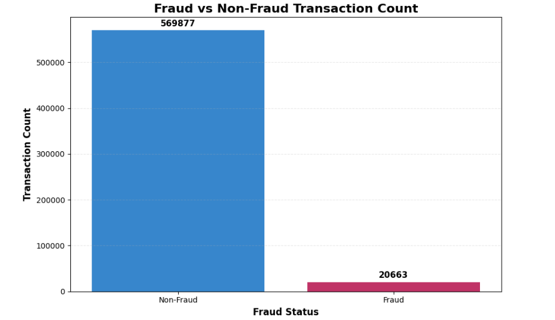
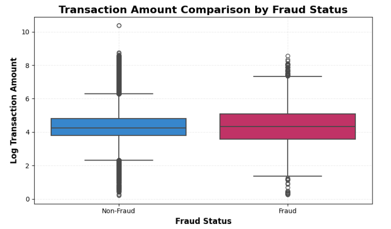
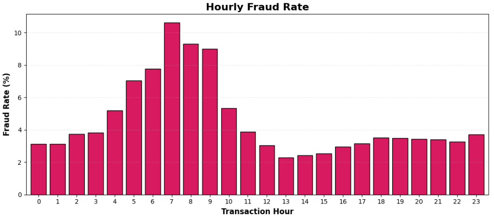
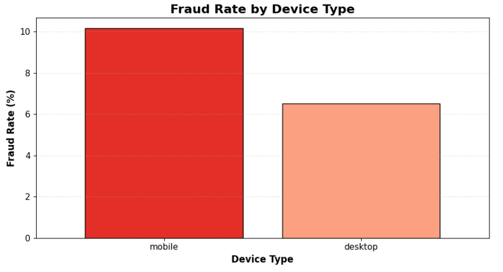
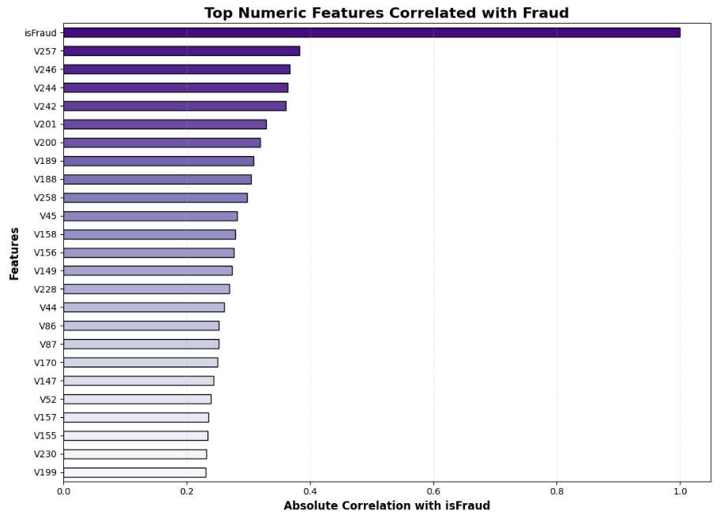
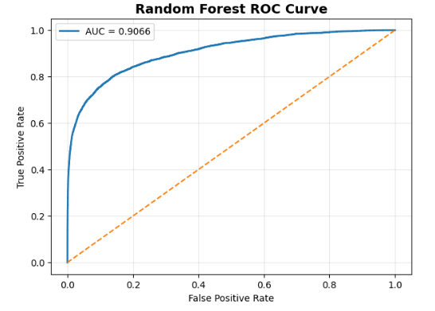

# 🕵️ Fraud Transaction Detection & Risk Intelligence System

## 📌 Project Overview

This project builds a complete Fraud Detection and Risk Intelligence System using transaction-level and identity-level financial data.

The goal of this project is to analyze fraudulent transaction behavior, identify suspicious transaction patterns, engineer fraud-related features, apply anomaly detection, and build machine learning models for fraud prediction.

The project uses the real-world IEEE-CIS Fraud Detection dataset containing large-scale financial transaction and identity information.

---

---

# 🎯 Project Objective

- Detect fraudulent financial transactions
- Analyze transaction and identity behavior
- Engineer fraud-related risk features
- Handle highly imbalanced fraud data
- Compare multiple Machine Learning models
- Apply anomaly detection techniques
- Generate fraud probability and risk intelligence
- Create transaction-level risk segmentation

---

# 🛠️ Technologies Used

## 📚 Libraries

- pandas
- numpy
- matplotlib
- seaborn
- scikit-learn

---

# 📂 Dataset Information

The project uses the IEEE-CIS Fraud Detection dataset containing:

- Financial transaction data
- Transaction amount information
- Card-related features
- Email domain information
- Address and distance features
- Device and identity information
- Behavioral transaction patterns

---

## 📁 Dataset Files

The project uses:

- train_transaction.csv
- train_identity.csv

---

### 🎯 Target Variable

| Value | Meaning |
|---|---|
| 0 | Normal Transaction |
| 1 | Fraud Transaction |

---

# 🔄 Project Workflow

**Raw Transaction Data → Data Cleaning → Fraud EDA → Feature Engineering → Risk Feature Creation → Data Preprocessing → Machine Learning → Model Evaluation → Anomaly Detection → Risk Intelligence → Business Insights**

---

# 🧹 Data Cleaning & Preprocessing

The project includes:

- Missing value analysis
- Duplicate checking
- Transaction and identity data merging
- High missing column removal
- Label encoding
- Null value handling
- Log transformation
- Feature scaling preparation

---

# 📊 Exploratory Data Analysis

The project includes analysis on:

- Fraud Distribution
- Transaction Amount Analysis
- Time-Based Fraud Analysis
- Product Fraud Analysis
- Card Fraud Analysis
- Email Domain Fraud Analysis
- Device Fraud Analysis
- Identity Missing Pattern Analysis
- Risk Pattern Analysis

---

# 📷 Project Images

## 📌 Fraud vs Non-Fraud Transaction Count

---

## 📌 Transaction Amount Comparison by Fraud Status

---

## 📌 Hourly Fraud Rate

---

## 📌 Fraud Rate by Device Category

---

## 📌 Top Important Fraud Detection Features

---

## 📌 Random Forest ROC Curve

---

# ⚙️ Feature Engineering

Created fraud-focused features such as:

- Transaction Amount Log Features
- Amount Bucket Features
- High Amount Flags
- Transaction Hour Features
- Night Transaction Features
- Card Frequency Features
- Card Combination Features
- Email Frequency Features
- Email Match Features
- Distance Missing Flags
- Device Cleaning Features
- Identity Missing Count
- Custom Risk Score Features

---

# 🤖 Machine Learning Models

## Models Used

- Logistic Regression
- Random Forest
- Isolation Forest

---

# ⚙️ Data Preprocessing

The preprocessing pipeline includes:

- Train-Validation Split
- Missing Value Handling
- Label Encoding
- Feature Selection
- High Missing Column Removal
- Numeric and Categorical Processing

---

# 📈 Model Performance

| Model | Precision | Recall | F1 Score | ROC-AUC |
|---|---|---|---|---|
| Logistic Regression | 0.1030 | 0.5684 | 0.1744 | 0.7328 |
| Random Forest | 0.2312 | 0.7433 | 0.3527 | 0.9066 |

---

# 🏆 Best Model

## Random Forest

### Final Performance

| Metric | Score |
|---|---|
| ROC-AUC | 0.9066 |
| Recall | 74.33% |

---

# 🔥 Key Business Insights

- Fraud transactions are highly imbalanced and represent only a small percentage of total transactions.
- Transaction amount patterns showed different fraud behavior across amount groups.
- Fraud activity changed significantly across different transaction hours.
- Product categories showed different fraud risk patterns.
- Card-related features became strong fraud indicators.
- Email domain behavior provided useful fraud intelligence signals.
- Mobile devices showed higher fraud activity compared to desktop devices.
- Missing identity and distance information became important fraud indicators.
- Custom risk scoring significantly improved fraud detection capability.
- Random Forest performed much better than Logistic Regression in fraud detection performance.
- Threshold tuning helped balance fraud detection and false alerts.
- Isolation Forest successfully detected unusual transaction behavior patterns.

---

# 🎯 Risk Intelligence System

The project generates:

- Fraud probability prediction
- Risk segmentation
- Transaction-level fraud intelligence

Transactions are divided into:

- Low Risk
- Medium Risk
- High Risk

---

# 🎯 Final Output

The system generates:

- Fraud probability scores
- Risk-based transaction segmentation
- Fraud intelligence output dataset
- Cleaned fraud-ready dataset

---

# 👨‍💻 About Me

## Sayan Naha

📧 **Email:** snsayan2012@gmail.com  
🔗 **LinkedIn:** [Sayan Naha](https://www.linkedin.com/in/sayan-naha/)
